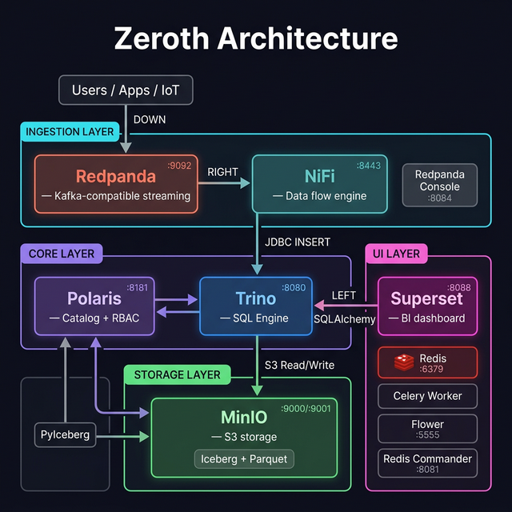

# Zeroth — Technical Architecture Document

> **A fully open-source data lakehouse — store, query, stream, and visualize data at any scale.**
>
> Version: 1.0 | Last Updated: February 2026

---

## Table of Contents

1. [Executive Summary](#1-executive-summary)
2. [Zeroth Architecture Overview](#2-zeroth-architecture-overview)
3. [Open-Source Component Mapping](#3-open-source-component-mapping)
4. [Storage Layer — MinIO](#4-storage-layer--minio)
5. [Table Format — Apache Iceberg + Parquet](#5-table-format--apache-iceberg--parquet)
6. [Catalog & Governance — Apache Polaris](#6-catalog--governance--apache-polaris)
7. [Query Engine — Trino](#7-query-engine--trino)
8. [Data Ingestion — Kafka + NiFi](#8-data-ingestion--kafka--nifi)
9. [Web UI — Apache Superset](#9-web-ui--apache-superset)
10. [Feature Parity Analysis](#10-feature-parity-analysis)
11. [Deployment Architecture](#11-deployment-architecture)
12. [Performance Considerations](#12-performance-considerations)
13. [Security Architecture](#13-security-architecture)
14. [Limitations & Trade-offs](#14-limitations--trade-offs)
15. [Roadmap](#15-roadmap)

---

## 1. Executive Summary

Zeroth is a fully open-source data lakehouse built on three architectural principles:

1. **Separation of storage and compute** — scale each independently
2. **Multi-cluster shared data** — concurrent workloads with zero contention
3. **Low administration overhead** — automated tuning, scaling, and maintenance via Kubernetes

This document describes Zeroth's architecture and the mature, production-proven technologies behind it. The stack centers on **seven pillars**:

| Pillar | Technology | Role |
|--------|-----------|------|
| **Storage** | MinIO | S3-compatible object storage |
| **Table Format** | Apache Iceberg + Parquet | ACID tables on object storage |
| **Catalog** | Apache Polaris | Metadata, RBAC, discovery |
| **Query Engine** | Trino | Distributed SQL (MPP) |
| **Streaming** | Redpanda | Kafka-compatible event streaming (C++, no JVM) |
| **Ingestion** | Apache NiFi | Visual data flow & ETL routing |
| **Web UI** | Apache Superset | SQL IDE, dashboards, data explorer |

All orchestrated on **Kubernetes** for elastic scaling.

### Current Architecture



---

## 2. Zeroth Architecture Overview

Zeroth's architecture has three distinct layers:

```
┌─────────────────────────────────────────────────────────────┐
│                    Cloud Services Layer                      │
│   (Authentication, Metadata, Query Optimization, RBAC)      │
├──────────┬──────────┬──────────┬──────────┬─────────────────┤
│    VW 1  │   VW 2   │   VW 3   │   VW 4   │   ...           │
│  (XS)    │  (S)     │  (M)     │  (L)     │                 │
│          │          │          │          │  Compute Layer    │
├──────────┴──────────┴──────────┴──────────┴─────────────────┤
│                Centralized Storage Layer                      │
│          (Micro-partitions in columnar format)               │
└─────────────────────────────────────────────────────────────┘
```

### Key Design Principles

| Principle | Description |
|-----------|-------------|
| **Shared-nothing compute** | Each virtual warehouse (VW) is an independent MPP cluster |
| **Shared storage** | All compute clusters read/write the same data |
| **Micro-partitions** | Data stored as immutable, compressed columnar files (50–500 MB) |
| **Automatic clustering** | Data is automatically organized for query performance |
| **Multi-cluster warehouses** | Auto-scale by adding clusters when concurrency spikes |

---

## 3. Open-Source Component Architecture

```
┌──────────────────────────────────────────────────────────────────────┐
│                          Zeroth                                      │
├──────────────────┬──────────────────┬────────────────────────────────┤
│   Cloud Services │  Compute         │   Centralized                  │
│   Layer          │  Layer           │   Storage                      │
├──────────────────┼──────────────────┼────────────────────────────────┤
│ Apache Polaris   │  Trino           │  MinIO                         │
│ (Catalog, RBAC)  │  (MPP SQL)       │  (S3-compatible Object Store)  │
│                  │                  │                                │
│ + Apache Ranger  │  on Kubernetes   │  + Apache Iceberg              │
│ + OPA            │  (auto-scaling)  │  + Apache Parquet              │
└──────────────────┴──────────────────┴────────────────────────────────┘
```

---

## 4. Storage Layer — MinIO

### Why MinIO?

MinIO is a **high-performance, S3-compatible object storage** system. It is the de facto standard for self-hosted object storage.

| Aspect | Details |
|--------|---------|
| **S3 Compatibility** | Full AWS S3 API compatibility — Iceberg, Trino, Spark all work natively |
| **Performance** | Designed for high-throughput workloads; benchmarks show performance comparable to cloud S3 |
| **Erasure Coding** | Data protection without RAID; configurable redundancy |
| **Encryption** | SSE-S3, SSE-KMS, and SSE-C encryption at rest |
| **Multi-site Replication** | Async replication across sites for DR |

### Storage Concepts

| Concept | MinIO Implementation |
|---|---|
| Internal stage | S3 bucket (e.g., `s3://warehouse/`) |
| Micro-partition files | Parquet files in bucket prefixes |
| Storage auto-scaling | MinIO cluster expansion (add nodes) |
| Cross-region replication | MinIO site replication |

### Configuration

```yaml
# MinIO deployment sizing
# Single-node dev:     1 node,  1 drive
# Production minimum:  4 nodes, 4 drives each (erasure coding)
# Large scale:         16+ nodes, NVMe drives

MINIO_ROOT_USER: admin
MINIO_ROOT_PASSWORD: <strong-password>
MINIO_VOLUMES: "/data{1...4}"        # 4 drives per node
MINIO_SERVER_URL: "https://minio.example.com"
```

### Storage Tiers (Automatic Tiering)

MinIO supports **Information Lifecycle Management (ILM)** rules to move cold data to cheaper tiers:

```json
{
  "Rules": [
    {
      "Status": "Enabled",
      "Filter": { "Prefix": "warehouse/" },
      "Transition": {
        "Days": 90,
        "StorageClass": "GLACIER"    // Move to cold tier after 90 days
      }
    }
  ]
}
```

---

## 5. Table Format — Apache Iceberg + Parquet

### The Critical Abstraction

Apache Iceberg is the **most important component** in this architecture. It provides the **table abstraction** that makes object storage act like a data warehouse.

```
┌─────────────────────────────────────┐
│          Apache Iceberg              │
│   ┌──────────────────────────────┐  │
│   │     Metadata Layer           │  │
│   │  • Table schema              │  │
│   │  • Partition spec            │  │
│   │  • Snapshot history          │  │
│   │  • Sort order                │  │
│   └──────────┬───────────────────┘  │
│              │                       │
│   ┌──────────▼───────────────────┐  │
│   │     Manifest Lists           │  │
│   │  (pointers to manifests)     │  │
│   └──────────┬───────────────────┘  │
│              │                       │
│   ┌──────────▼───────────────────┐  │
│   │     Manifest Files           │  │
│   │  (pointers to data files     │  │
│   │   + column-level stats)      │  │
│   └──────────┬───────────────────┘  │
│              │                       │
│   ┌──────────▼───────────────────┐  │
│   │     Data Files (Parquet)     │  │
│   │  (columnar, compressed,      │  │
│   │   50-500 MB each)            │  │
│   └──────────────────────────────┘  │
└─────────────────────────────────────┘
```

### Feature Overview

| Feature | Iceberg Implementation | Notes |
|---|---|---|
| **Micro-partitions** | Parquet data files | Same concept: immutable, columnar, ~100-500 MB |
| **Automatic clustering** | Sort orders + `optimize` | Manual trigger, but same effect |
| **Time Travel** | Snapshot-based time travel | Query any previous version via snapshot ID or timestamp |
| **Zero-copy Cloning** | Branching (via catalog) | New metadata pointer, no data copy |
| **Schema Evolution** | Native schema evolution | Add, rename, reorder, widen columns |
| **Partition Evolution** | Native partition evolution | Change partitioning without data rewrite |
| **ACID Transactions** | Optimistic concurrency | Serializable isolation via metadata swap |
| **Data Retention** | Snapshot expiration | `expire_snapshots` procedure |

### Why Iceberg Over Delta Lake or Hudi?

| Criteria | Iceberg | Delta Lake | Hudi |
|----------|---------|------------|------|
| **Engine independence** | ⭐ Any engine | Spark-centric | Spark-centric |
| **Partition evolution** | ⭐ Yes | No | No |
| **Hidden partitioning** | ⭐ Yes | No | No |
| **REST Catalog standard** | ⭐ Yes | Unity Catalog | No |
| **Industry adoption** | ⭐ Used natively by major cloud data warehouses | No | No |
| **Community momentum** | ⭐ Fastest growing | Large | Moderate |

### Parquet Format Details

Apache Parquet provides the **physical columnar storage**:

- **Columnar layout** — Read only the columns you need
- **Predicate pushdown** — Skip row groups that don't match filters
- **Dictionary encoding** — Compress low-cardinality columns
- **Snappy/ZSTD compression** — Typically 3-10x compression ratios
- **Row group stats** — Min/max values for partition pruning

```
Parquet File Structure:
┌─────────────────────┐
│ Row Group 1          │
│  ├─ Column A chunk   │  ← Dictionary + RLE encoded
│  ├─ Column B chunk   │  ← Snappy compressed
│  └─ Column C chunk   │
├─────────────────────┤
│ Row Group 2          │
│  ├─ Column A chunk   │
│  ├─ Column B chunk   │
│  └─ Column C chunk   │
├─────────────────────┤
│ Footer               │
│  ├─ Schema           │
│  ├─ Row group stats  │  ← Min/max for predicate pushdown
│  └─ Column stats     │
└─────────────────────┘
```

---

## 6. Catalog & Governance — Apache Polaris

### Why Polaris?

Apache Polaris was **originally developed as an internal Iceberg catalog** for a major cloud data platform, then open-sourced and donated to the Apache Software Foundation. It is the **reference implementation** of the Iceberg REST Catalog specification.

### Polaris Architecture

```
┌──────────────────────────────────────────────┐
│              Apache Polaris                  │
│                                              │
│  ┌─────────────────────────────────────────┐ │
│  │          REST Catalog API               │ │
│  │  (Iceberg REST Spec compliant)          │ │
│  └──────────┬──────────────────────────────┘ │
│             │                                │
│  ┌──────────▼──────────────────────────────┐ │
│  │     Catalog Management                  │ │
│  │  • Namespaces (≈ databases)         │ │
│  │  • Tables                               │ │
│  │  • Views                                │ │
│  └──────────┬──────────────────────────────┘ │
│             │                                │
│  ┌──────────▼──────────────────────────────┐ │
│  │     Access Control (RBAC)               │ │
│  │  • Catalog roles                        │ │
│  │  • Principal roles                      │ │
│  │  • Privilege grants                     │ │
│  └──────────┬──────────────────────────────┘ │
│             │                                │
│  ┌──────────▼──────────────────────────────┐ │
│  │     Storage Profiles                    │ │
│  │  • S3, GCS, ADLS, MinIO                 │ │
│  │  • Vended credentials                   │ │
│  └─────────────────────────────────────────┘ │
└──────────────────────────────────────────────┘
```

### Mapping to Data Platform Concepts

| Data Platform Concept | Polaris Equivalent |
|---|---|
| Account | Catalog (top-level container) |
| Database | Namespace |
| Schema | Nested namespace |
| Table | Iceberg table |
| Role | Catalog role + Principal role |
| GRANT privilege | Privilege grant API |
| Data sharing | Cross-catalog table access |

### RBAC Model

Polaris provides **enterprise-grade RBAC** with two role types:

```
Principal Roles (WHO)          Catalog Roles (WHAT)
┌───────────────┐              ┌──────────────────┐
│ data_engineer  │──grants──▶  │ warehouse_admin   │──privileges──▶ Tables
│ analyst        │──grants──▶  │ read_only         │──privileges──▶ Namespaces
│ ml_engineer    │──grants──▶  │ ml_read_write     │──privileges──▶ Views
└───────────────┘              └──────────────────┘
```

**Supported privileges:**
- `CATALOG_MANAGE_CONTENT` — Full DDL/DML
- `TABLE_READ_DATA` — SELECT on tables
- `TABLE_WRITE_DATA` — INSERT/UPDATE/DELETE
- `TABLE_CREATE` — Create new tables
- `NAMESPACE_CREATE` — Create namespaces
- `VIEW_CREATE` — Create views

### Polaris vs. Nessie — When to Use Each

| Use Case | Polaris | Nessie |
|----------|---------|--------|
| Standard Iceberg catalog | ⭐ Reference implementation | ✅ Supported |
| Built-in RBAC | ⭐ Native | ❌ External needed |
| Git-like branching | ❌ Not supported | ⭐ Core feature |
| CI/CD for data | ❌ Not supported | ⭐ Branch → test → merge |
| Enterprise parity | ⭐ Highest (from major cloud vendor) | ✅ Partial |
| Multi-engine support | ⭐ REST standard | ⭐ REST + native |

> **Recommendation:** Use **Polaris as primary catalog** for production governance. Add **Nessie** alongside it if you need data versioning / branching workflows (e.g., staging → production promotions).

---

## 7. Query Engine — Trino

### Why Trino?

Trino (formerly PrestoSQL) is an **open-source distributed SQL query engine** designed for interactive analytics. In Zeroth, Trino clusters serve as the compute layer.

### Architecture

```
┌───────────────────────────────────────────────────┐
│                  Trino Cluster                     │
│            (≈ Zeroth Compute Cluster)              │
│                                                    │
│  ┌─────────────────────────────────────────────┐  │
│  │              Coordinator                     │  │
│  │  • Query parsing & planning                  │  │
│  │  • Cost-based optimizer                      │  │
│  │  • Query scheduling                          │  │
│  │  • Web UI (port 8080)                        │  │
│  └──────────┬──────────────────────────────────┘  │
│             │  distributes work                    │
│  ┌──────────▼──────────────────────────────────┐  │
│  │              Workers (N nodes)               │  │
│  │  • Parallel data processing                  │  │
│  │  • In-memory pipeline execution              │  │
│  │  • Local caching (Alluxio optional)          │  │
│  └─────────────────────────────────────────────┘  │
└───────────────────────────────────────────────────┘
```

### Compute Layer Concepts

| Concept | Trino Implementation |
|---|---|
| Virtual Warehouse (XS–6XL) | Trino cluster (configure worker count) |
| Multi-cluster warehouse | Multiple Trino clusters on K8s |
| Auto-suspend | K8s HPA scale-to-zero (KEDA) |
| Auto-resume | K8s KEDA trigger on query arrival |
| Query result caching | Trino result caching + Alluxio data caching |
| Resource monitor | Trino resource groups |

### Virtual Warehouse Sizing Equivalent

| Cluster Size | Trino Configuration | Workers | Memory/Worker |
|---|---|---|---|
| X-Small | trino-xs | 1 | 8 GB |
| Small | trino-sm | 2 | 16 GB |
| Medium | trino-md | 4 | 32 GB |
| Large | trino-lg | 8 | 64 GB |
| X-Large | trino-xl | 16 | 64 GB |
| 2X-Large | trino-2xl | 32 | 128 GB |

### Concurrency & Resource Groups

Trino's **Resource Groups** provide concurrency controls:

```json
{
  "rootGroups": [
    {
      "name": "etl",
      "maxQueued": 100,
      "hardConcurrencyLimit": 10,
      "softMemoryLimit": "60%",
      "schedulingPolicy": "fair"
    },
    {
      "name": "analytics",
      "maxQueued": 500,
      "hardConcurrencyLimit": 50,
      "softMemoryLimit": "30%",
      "schedulingPolicy": "fair"
    },
    {
      "name": "adhoc",
      "maxQueued": 50,
      "hardConcurrencyLimit": 5,
      "softMemoryLimit": "10%"
    }
  ]
}
```

### Connectors (Federated Query — Bonus!)

Trino can also query **multiple data sources** simultaneously (federated queries):

```sql
-- Query across Iceberg, PostgreSQL, and MongoDB in one query!
SELECT
    i.user_id,
    i.total_purchases,
    p.email,
    m.preferences
FROM iceberg.analytics.purchases i
JOIN postgresql.users.profiles p ON i.user_id = p.id
JOIN mongodb.app.user_prefs m ON i.user_id = m.user_id;
```

---

## 8. Data Ingestion — Redpanda + NiFi

### The Ingestion Problem

For automatic data ingestion — where events or files are continuously loaded into Iceberg tables — Zeroth uses two components:

- **Redpanda** — Kafka-compatible event streaming in C++ (handles real-time data streams)
- **Apache NiFi** — Visual data flow engine (handles automatic ingestion pipelines)

### Pipeline Architecture: Redpanda → NiFi → Iceberg

```
Data Sources                Streaming Buffer          Data Flow Engine           Lakehouse
────────────                ────────────────          ────────────────           ─────────

APIs          ─┐                                     ┌─ ConvertRecord ─┐
Databases     ─┤                                     │  (JSON→Parquet) │
Files (S3)    ─┼──▶ Redpanda Topics ──▶ Apache NiFi ─┤                 ├──▶ Iceberg Tables
IoT Sensors   ─┤    (ConsumeKafka)     (visual UI)   │  RouteOnAttr    │    (on MinIO)
Log Streams   ─┘                                     │  ValidateRecord │
                                                     └── PutIceberg  ──┘
```

### Why Redpanda? (Streaming Buffer)

| Aspect | Details |
|--------|---------|
| **Role** | High-throughput event buffer between producers and NiFi |
| **Kafka compatible** | 100% Kafka wire-protocol compatible — all Kafka clients work unchanged |
| **No JVM** | Written in C++, uses ~256 MB RAM vs Kafka's ~1-2 GB |
| **Replay** | Consumers can re-read historical events (change data capture equivalent) |
| **Decoupling** | Multiple consumers (NiFi, Spark, Flink) can read the same topics |
| **Throughput** | Millions of events/sec per cluster |
| **Retention** | Configurable retention (7 days default, up to infinite) |

### Why NiFi? (Data Flow Engine)

| Aspect | Details |
|--------|---------|
| **Role** | Visual, drag-and-drop data routing and transformation |
| **Auto-ingestion** | Consumes from Redpanda, transforms, writes to Iceberg via Trino |
| **300+ processors** | Built-in connectors for files, databases, APIs, cloud services |
| **PutDatabaseRecord** | JDBC-based Iceberg writer via Trino (PutIceberg has MinIO compatibility issues) |
| **Backpressure** | Built-in per-connection backpressure (prevents data loss) |
| **Visual monitoring** | Real-time flow monitoring, error handling, provenance tracking |
| **No code required** | Data engineers configure pipelines via UI, not code |

### NiFi Flow: Redpanda → Trino → Iceberg

The working NiFi pipeline uses **PutDatabaseRecord** with Trino JDBC to write to Iceberg tables. NiFi's `PutIceberg` processor has a known NPE bug with non-AWS S3 endpoints like MinIO (`writer is null`), so data is routed through Trino instead:

```
┌──────────────┐    ┌───────────────────┐
│ ConsumeKafka │──▶ │ PutDatabaseRecord │
│              │    │                   │
│ bootstrap:   │    │ JDBC: Trino       │
│ redpanda:9092│    │ Table: events     │
│ topic:       │    │ Auto-Commit: true │
│ raw-events   │    │ Reader: JSON      │
└──────────────┘    └────────┬──────────┘
                             │ INSERT via JDBC
                    ┌────────▼──────────┐
                    │  Trino (SQL)      │
                    │  → Iceberg format │
                    │  → MinIO (S3)     │
                    └───────────────────┘
```

> **Why not PutIceberg?** NiFi 2.8.0's PutIceberg produces a `NullPointerException: writer is null` when writing to MinIO. The Parquet DataWriter factory fails silently for non-AWS S3 endpoints. Routing writes through Trino's JDBC driver bypasses this entirely since Trino already has working MinIO integration.

### Key NiFi Processors for Zeroth

| Processor | Purpose |
|-----------|---------|
| `ConsumeKafka` | Read events from Redpanda topics (Kafka wire-compatible) |
| `PutDatabaseRecord` | Insert records into Iceberg tables via Trino JDBC |
| `ConvertRecord` | Transform between formats (JSON/Avro/CSV) |
| `ValidateRecord` | Schema validation before writing |
| `RouteOnAttribute` | Route events to different Iceberg tables by type |
| `PutS3Object` | Write to MinIO (dead letter queue, raw archives) |
| `QueryRecord` | SQL-like filtering and transformation within NiFi |

### Redpanda + NiFi vs. Flink

| Aspect | Redpanda → **NiFi** → Iceberg | Redpanda → **Flink** → Iceberg |
|--------|-------------------------------|-------------------------------|
| **Setup** | 🟢 Visual, drag-and-drop | 🔴 Java/SQL code |
| **Learning curve** | 🟢 Low | 🔴 High |
| **Transformations** | 🟢 300+ built-in processors | 🟢 Full SQL/Java |
| **Windowed aggregations** | 🔴 Not supported | 🟢 Native (tumbling, sliding) |
| **Exactly-once** | 🟡 At-least-once | 🟢 Exactly-once |
| **Throughput** | 🟡 ~100K events/sec | 🟢 Millions/sec |
| **Monitoring** | 🟢 Built-in visual UI | 🔴 Separate dashboards |
| **Best for** | ETL, file routing, moderate scale | Real-time analytics, high scale |

> **Recommendation:** Start with **Redpanda → NiFi → Iceberg** for most workloads. Add Flink only if you need windowed stream aggregations or exactly-once at extreme scale.

---

## 9. Web UI — Apache Superset

### Why Superset?

Apache Superset is an **open-source BI platform** that serves as Zeroth's web console. It provides a SQL editor, rich dashboards, and data exploration — all connected to Trino.

### Web Console Features

| Feature | Superset Implementation |
|---|---|
| **Worksheets** (SQL editor) | **SQL Lab** — full SQL IDE with auto-complete, query history |
| **Dashboards** | **Dashboards** — 50+ chart types, filters, drill-down |
| **Data Explorer** | **Dataset browser** — browse schemas, tables, columns |
| **Query History** | **Query history** — past queries, re-run, share |
| **Charts & Viz** | **Explore** — bar, line, pie, heatmap, geospatial, etc. |
| **Sharing** | **Dashboard sharing** — public links, embedded iframes |
| **RBAC** | **Role-based access** — row-level security, dataset permissions |
| **Alerts** | **Alerts & Reports** — scheduled queries, email/Slack alerts |

### Architecture

```
┌─────────────────────────────────────────────────────┐
│              Apache Superset                        │
│          (≈ Zeroth Web Console)                     │
│                                                     │
│  ┌──────────────┐  ┌───────────┐  ┌──────────────┐  │
│  │  SQL Lab     │  │ Dashboards│  │ Data Explorer│  │
│  │  (Worksheets)│  │ (Charts)  │  │ (Datasets)   │  │
│  └──────┬───────┘  └─────┬─────┘  └──────┬───────┘  │
│         └────────────────┼───────────────┘          │
│                          │                          │
│                          │                          │
│               ┌──────────▼─────────────┐            │
│               │  SQLAlchemy + Trino    │            │
│               │  (trino://trino:8080)  │            │
│               └────────────────────────┘            │
└─────────────────────────────────────────────────────┘
                           │ 
             ┌─────────────▼───────────┐
             │    Trino Query Engine   │
             │    (Iceberg on MinIO)   │
             └─────────────────────────┘
```

### Connecting Superset to Trino

Superset connects to Trino via the **SQLAlchemy Trino driver**:

```
# Superset database connection string
trino://trino@trino:8080/iceberg
```

Once connected, all Iceberg schemas and tables are browsable in Superset's SQL Lab, and queryable for dashboards.

### Key Superset Features for Zeroth

| Feature | Description |
|---------|-----------|
| **SQL Lab** | Full SQL IDE with syntax highlighting, auto-complete, and results grid |
| **50+ chart types** | Bar, line, pie, treemap, heatmap, geospatial, time-series, etc. |
| **Dashboard filters** | Cross-filter across charts, date range pickers, dropdown filters |
| **Jinja templating** | Dynamic SQL with `{{ current_username() }}`, date macros |
| **Row-level security** | Restrict data visibility per role (row access policies) |
| **Alerts & Reports** | Schedule queries, get notified on thresholds (email/Slack) |
| **Embedded analytics** | Embed dashboards via iframe in your own apps |
| **Caching** | Redis-backed query caching for faster dashboard loads |

---

## 10. Feature Parity Analysis

### Full Feature Comparison

| Feature | Status | Technology | Notes |
|---|:---:|---|---|
| **Separation of storage/compute** | ✅ Full | MinIO + Trino | None |
| **Columnar storage** | ✅ Full | Apache Parquet | None |
| **ACID transactions** | ✅ Full | Apache Iceberg | None |
| **Time Travel** | ✅ Full | Iceberg snapshots | None |
| **Zero-copy cloning** | ✅ Full | Iceberg branches/tags | None |
| **Schema evolution** | ✅ Full | Iceberg native | None |
| **Partition evolution** | ⭐ Advanced | Iceberg native | Change partitioning without data rewrite |
| **SQL engine (ANSI SQL)** | ✅ Full | Trino | Minor syntax diffs |
| **RBAC** | ✅ Full | Polaris | None |
| **Concurrency scaling** | ✅ Full | K8s + multi-cluster Trino | Requires K8s expertise |
| **Auto-suspend/resume** | ⚠️ Partial | KEDA + K8s HPA | Not as seamless |
| **Semi-structured data** | ✅ Full | Trino JSON functions | None |
| **Secure data sharing** | ⚠️ Partial | Polaris cross-catalog | Less polished |
| **Streams & Tasks** | ✅ Full | Redpanda (streaming) + NiFi (routing) | Visual pipeline builder |
| **Auto-ingest** | ✅ Full | Redpanda → NiFi → PutIceberg | NiFi drag-and-drop UI |
| **Query result caching** | ⚠️ Partial | Trino + Alluxio | Not as transparent |
| **Materialized views** | ❌ Gap | Not native in Iceberg/Trino | Use dbt for models |
| **UDFs (Java/Python)** | ⚠️ Partial | Trino UDFs (Java) | No Python UDFs |
| **Search optimization** | ⚠️ Partial | Iceberg file-level stats | Less granular |
| **Governance (masking, tags)** | ⚠️ Partial | Ranger + custom | More manual |

### What's Better in the Open-Source Stack

| Feature | Advantage |
|---------|-----------|
| **Partition evolution** | Change partitioning without data rewrite |
| **Federated queries** | Query Postgres, MongoDB, Kafka, etc. alongside Iceberg |
| **Engine flexibility** | Use Spark, Flink, DuckDB, or Trino on the same tables |
| **Vendor independence** | No lock-in; portable Iceberg tables |
| **Cost** | No vendor license fees; pay only for infrastructure |

---

## 11. Deployment Architecture

### Development (Docker Compose — 14 services, 3 profiles)

```
docker-compose.yml (3 profiles)

  Profile: core
  ├── MinIO              (S3 storage)       → localhost:9000 / :9001 (console)
  ├── minio-init         (bucket creation)  → creates warehouse + iceberg buckets
  ├── PostgreSQL         (Polaris metadata) → localhost:5432
  ├── Polaris            (catalog + RBAC)   → localhost:8181 / :8182 (mgmt)
  └── Trino              (query engine)     → localhost:8080

  Profile: bootstrap-db / bootstrap (run once)
  ├── polaris-db-bootstrap   (schema migration)
  └── polaris-bootstrap      (catalog, roles, grants)

  Profile: ingestion
  ├── Redpanda           (streaming, C++)   → localhost:9092 / :8082 (HTTP)
  ├── Redpanda Console   (streaming UI)     → localhost:8084
  └── NiFi               (data flow)        → https://localhost:8443

  Profile: ui
  ├── Redis              (cache + broker)   → localhost:6379
  ├── Redis Commander    (Redis UI)         → localhost:8081
  ├── Superset DB        (PostgreSQL)       → localhost:5433
  ├── Superset           (BI / SQL Lab)     → localhost:8088
  ├── Superset Worker    (Celery async)     → background
  └── Superset Flower    (task monitor)     → localhost:5555
```

See [`docker/docker-compose.yml`](../docker/docker-compose.yml) for the full configuration.

### Production (Kubernetes)

```
┌──────────────────────────────────────────────────────────────────┐
│                        Kubernetes Cluster                        │
│                                                                  │
│  ┌──────────────────────────────────────────────────────────┐   │
│  │  Namespace: data-platform                                 │   │
│  │                                                           │   │
│  │  ┌─────────────┐  ┌─────────────┐  ┌─────────────────┐  │   │
│  │  │   Polaris    │  │  Trino ETL  │  │ Trino Analytics │  │   │
│  │  │  (catalog)   │  │  Cluster    │  │   Cluster       │  │   │
│  │  │  Deployment  │  │  (VW #1)    │  │   (VW #2)       │  │   │
│  │  │  replicas: 2 │  │  workers: 8 │  │  workers: 4     │  │   │
│  │  └──────┬───────┘  └──────┬──────┘  └───────┬─────────┘  │   │
│  │         │                 │                  │            │   │
│  │         └─────────────────┼──────────────────┘            │   │
│  │                           │                               │   │
│  │                    ┌──────▼──────┐                        │   │
│  │                    │    MinIO     │                        │   │
│  │                    │  StatefulSet │                        │   │
│  │                    │  nodes: 4    │                        │   │
│  │                    └─────────────┘                        │   │
│  └──────────────────────────────────────────────────────────┘   │
│                                                                  │
│  ┌──────────────────────────────────────────────────────────┐   │
│  │  Namespace: monitoring                                    │   │
│  │  Prometheus + Grafana                                     │   │
│  └──────────────────────────────────────────────────────────┘   │
└──────────────────────────────────────────────────────────────────┘
```

### Auto-Scaling with KEDA

```yaml
# Scale Trino workers based on pending queries (auto-scale)
apiVersion: keda.sh/v1alpha1
kind: ScaledObject
metadata:
  name: trino-worker-scaler
spec:
  scaleTargetRef:
    name: trino-worker
  minReplicaCount: 0        # Scale to zero when idle (auto-suspend!)
  maxReplicaCount: 32       # Max workers
  triggers:
    - type: prometheus
      metadata:
        serverAddress: http://prometheus:9090
        metricName: trino_queued_queries
        threshold: "5"      # Scale up when >5 queries queued
        query: |
          trino_queries_queued_total{cluster="analytics"}
```

---

## 12. Performance Considerations

### Query Performance Optimization

| Technique | How | Equivalent Concept |
|-----------|-----|---------------------|
| **Partition pruning** | Iceberg hidden partitioning + manifest stats | Micro-partition pruning |
| **Predicate pushdown** | Parquet row group min/max + Iceberg file stats | Automatic pruning |
| **Columnar projection** | Read only needed columns from Parquet | Columnar scan |
| **Data compaction** | `ALTER TABLE ... EXECUTE optimize` | Automatic clustering |
| **Sort ordering** | Iceberg sort orders (z-order supported) | Cluster keys |
| **Caching** | Alluxio (data) + Trino result cache | Result cache + local disk |

### Benchmarks (Approximate)

Benchmarks vary by hardware, data, and query patterns. General guidance:

| Workload | Expected Performance |
|----------|-----------------------------------|
| Simple aggregations (scan-heavy) | **80-100%** — Trino + Parquet is very efficient |
| Complex joins (shuffle-heavy) | **60-80%** of managed cloud warehouses — their optimizers have years of tuning |
| High concurrency (100+ users) | **70-90%** — requires proper K8s tuning |
| Semi-structured (JSON) | **70-85%** of managed warehouses — VARIANT types are deeply optimized |
| Time travel queries | **95-100%** — Iceberg snapshots are very efficient |

### Caching Architecture

```
Query Flow:
                                        ┌──────────────┐
Client ──▶ Trino Coordinator ──▶ Check ─┤ Result Cache │ ──▶ Return cached result
                                        └──────┬───────┘
                                               │ miss
                                        ┌──────▼───────┐
                                        │ Alluxio      │ ──▶ Read from local SSD
                                        │ (data cache) │
                                        └──────┬───────┘
                                               │ miss
                                        ┌──────▼───────┐
                                        │ MinIO (S3)   │ ──▶ Read from object storage
                                        └──────────────┘
```

---

## 13. Security Architecture

### Defense in Depth

```
┌─────────────────────────────────────────────────────────┐
│  Layer 1: Network Security                              │
│  • K8s Network Policies                                 │
│  • TLS everywhere (mTLS between services)               │
├─────────────────────────────────────────────────────────┤
│  Layer 2: Authentication                                │
│  • OAuth 2.0 / OIDC (Keycloak)                          │
│  • LDAP integration                                     │
│  • Service-to-service mTLS                              │
├─────────────────────────────────────────────────────────┤
│  Layer 3: Authorization (RBAC)                          │
│  • Polaris: Catalog-level RBAC                          │
│  • Apache Ranger: Fine-grained table/column policies    │
│  • OPA: Policy-as-code for custom rules                 │
├─────────────────────────────────────────────────────────┤
│  Layer 4: Data Protection                               │
│  • MinIO SSE (encryption at rest)                       │
│  • TLS (encryption in transit)                          │
│  • Column-level masking (via Ranger)                    │
│  • Row-level filtering (via Ranger)                     │
├─────────────────────────────────────────────────────────┤
│  Layer 5: Auditing                                      │
│  • Trino query audit log                                │
│  • Polaris access audit log                             │
│  • MinIO access logs → centralized logging              │
└─────────────────────────────────────────────────────────┘
```

### Column-Level Security (via Ranger)

```xml
<!-- Apache Ranger Policy: Mask SSN column for analysts -->
<policy>
  <name>mask-ssn</name>
  <resources>
    <database>analytics</database>
    <table>customers</table>
    <column>ssn</column>
  </resources>
  <dataMaskPolicyItems>
    <roles>analyst</roles>
    <dataMaskType>MASK_SHOW_LAST_4</dataMaskType>
  </dataMaskPolicyItems>
</policy>
```

---

## 14. Limitations & Trade-offs

### Known Gaps vs. Managed Cloud Warehouses

| Area | Gap | Mitigation |
|------|-----|------------|
| **Zero-ops** | Open-source requires K8s expertise and operational overhead | Use managed K8s (EKS/GKE) + Helm charts + GitOps |
| **Query optimizer** | Managed warehouse optimizers have years of tuning on customer workloads | Trino's CBO is improving; contribute upstream |
| **Auto-clustering** | Managed warehouses automatically re-cluster data | Schedule `optimize` jobs via Airflow/cron |
| **Materialized views** | No native MVs in Trino + Iceberg | Use dbt incremental models |
| **Python UDFs** | Trino only supports Java UDFs | Use Spark for Python-heavy workloads |
| **Marketplace** | No data marketplace | Build custom using Polaris cross-catalog sharing |
| **Support & SLA** | Community support only | Starburst (commercial Trino) offers enterprise support |

### Operational Complexity

> [!WARNING]
> This stack trades **managed simplicity** for **full control and cost savings**. You will need:
> - Kubernetes expertise (or managed K8s)
> - Monitoring and alerting (Prometheus + Grafana)
> - On-call for storage, compute, and catalog components
> - Performance tuning knowledge

### When NOT to Use This Stack

- **Small team (< 5 engineers)** with no K8s experience → Consider a managed cloud warehouse
- **Need it running today** → Managed services are faster to deploy
- **Compliance requires vendor SLAs** → Use Starburst (commercial Trino) or Tabular (commercial Iceberg)

---

## 15. Roadmap

### Phase 1: Foundation ✅
- [x] MinIO storage cluster with path-style S3 access
- [x] Apache Polaris catalog with PostgreSQL persistence
- [x] Polaris bootstrap automation (catalog, roles, privileges)
- [x] Single Trino cluster with Native S3 + OAuth2
- [x] Basic SQL queries on Iceberg tables (schema → table → insert → select)
- [x] Docker Compose local dev environment with phased startup
- [x] PyIceberg Python ingestion script

### Phase 2: Data Ingestion + BI ✅
- [x] Deploy Redpanda (Kafka-compatible, C++, no JVM)
- [x] Deploy Apache NiFi (HTTPS, single-user auth)
- [x] Deploy Superset with Celery workers, Flower, Redis
- [ ] Build Redpanda → NiFi → Iceberg pipeline
- [ ] Configure ConsumeKafka + PutIceberg flow
- [ ] Set up dead letter queue for failed records
- [ ] Create sample Superset dashboard with Trino connection

### Phase 3: Governance (Weeks 5–6)
- [x] Configure Polaris RBAC (catalog roles, principal roles)
- [ ] Set up authentication (OAuth/OIDC)
- [ ] Column-level masking with Ranger
- [ ] Audit logging

### Phase 4: Production (Weeks 7–10)
- [ ] Kubernetes deployment (Helm charts)
- [ ] Multi-cluster Trino (ETL + Analytics warehouses)
- [ ] Auto-scaling with KEDA
- [ ] Monitoring (Prometheus + Grafana dashboards)
- [ ] Alluxio caching layer

### Phase 5: Advanced (Weeks 11–14)
- [ ] dbt integration for transformations
- [ ] Cross-catalog data sharing via Polaris
- [ ] Disaster recovery (MinIO site replication)
- [ ] Cost management and chargeback
- [ ] Add Flink for windowed stream processing (if needed)

---

## References

- [Apache Iceberg Documentation](https://iceberg.apache.org/docs/latest/)
- [Apache Polaris (Incubating)](https://polaris.apache.org/)
- [Trino Documentation](https://trino.io/docs/current/)
- [MinIO Documentation](https://min.io/docs/)
- [Apache Kafka](https://kafka.apache.org/documentation/)
- [Apache NiFi Documentation](https://nifi.apache.org/docs.html)
- [Apache Parquet](https://parquet.apache.org/)
- [KEDA — Kubernetes Event-driven Autoscaling](https://keda.sh/)
- [Apache Ranger](https://ranger.apache.org/)
- [Data Warehouse Architecture Concepts](https://docs.snowflake.com/en/user-guide/intro-key-concepts)

---

*Document generated as part of the Zeroth project — Last updated: February 28, 2026*
